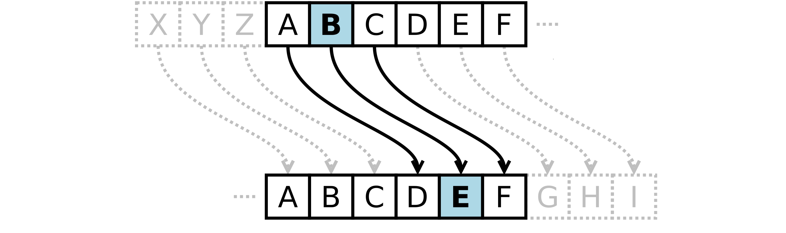
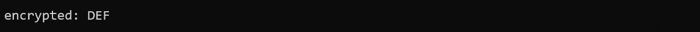
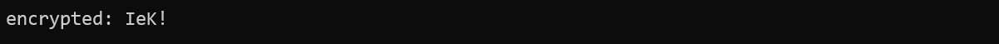
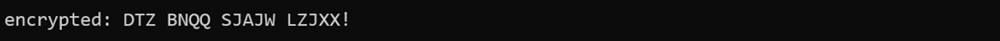
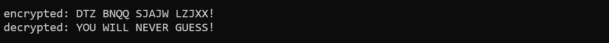
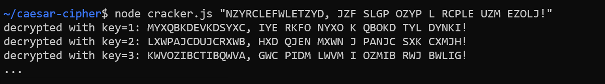

# Caesar Cipher

Ziel dieser Übung ist die Erstellung eines Moduls, dass die Ver- und Entschlüsselung mithilfe der Caesar-Verschiebung ermöglicht. Dabei handelt es sich um ein einfaches Verschlüsselungsverfahren, bei dem jeder Buchstabe um eine bestimmte Stellenanzahl im Alphabet verschoben wird. 

In der folgenden Abbildung ist eine Casear-Verschlüsselung mit dem Schlüssel 3 dargestellt:



## Task 1: Encrypt capital letters

Erstellen Sie das Modul `caesar.ts` und exportieren Sie die Funktion `encrypt(plain, key)`:

- Als erster Parameter wird ein String `plain` übergeben (der zu verschlüsselnde Text).
- Als zweiter Parameter wird eine Zahl `key` übergeben (die Verschiebung).
- Die Funktion verschlüsselt den Klartext mithilfe der Caeser-Verschiebung. Beachten Sie dabei:
  - Der Klartext besteht (vorerst) nur aus Großbuchstaben.
  - Ein Überlauf (Z -> A) muss (vorerst) nicht berücksichtigt werden.
- Die Funktion gibt den verschlüsselten Geheimtext zurück.

Importieren Sie das Modul in der Datei `app.ts` und prüfen Sie ob folgender Code zur abgebildeten Ausgabe führt:

```javascript
const cipher: string = encrypt('ABC', 3);
console.log(`encrypted: ${cipher}`);
```



#### Hinweise für die Lösung:

- Folgendermaßen können Sie auf den ASCII-Code des `i`-ten Klartextbuchstaben zugreifen:
  - `const code: number = plain.charCodeAt(i);`
- Mit `String.fromCharCode(newCode)` erhalten Sie den Buchstaben, des erhöhten ASCII-Codes.

## Task 2: Handle other symbols

Alle Zeichen des Klartexts, die keine Großbuchstaben sind, sollen dem Geheimtext unverschlüsselt hinzugefügt werden.

Prüfen Sie ob folgender Code zur abgebildeten Ausgabe führt:

```javascript
const cipher = caesar.encrypt('DeF!', 5);
console.log(`encrypted: ${cipher}`);
```



#### Hinweise für die Lösung:

- Folgendermaßen können Sie auf den ASCII-Code des Buchstaben *A* zugreifen:
  - `const codeOfA: number = 'A'.charCodeAt(0);`
- Verwenden Sie die ASCII-Codes von *A* und *Z* um zu prüfen, ob es sich bei dem zu verschlüsselnden Zeichen um einen Großbuchstaben handelt.

## Task 3: Handle overflow

Was passiert, wenn der Buchstabe *Y* um 5 verschoben wird? Nach *Z* beginnt das Alphabet wieder von vorne - das Ergebnis muss somit *D* lauten.

Passen Sie die Methode `encrypt()` an, sodass diese auch mit einem solchen Überlauf korrekt umgehen kann. Prüfen Sie anschließend ob folgender Code zur abgebildeten Ausgabe führt:

```javascript
const cipher: string = caesar.encrypt('YOU WILL NEVER GUESS!', 5);
console.log(`encrypted: ${cipher}`);
```



## Task 4: Decrypt cipher

Exportieren Sie im Modul `casear.ts` die Funktion `decrypt(cipher, key)`:

- Als erster Parameter wird ein String `cipher` übergeben (der verschlüsselte Geheimtext).
- Als zweiter Parameter wird eine Zahl `key` übergeben (die bei der Verschlüsselung verwendete Verschiebung).

Prüfen Sie ob folgender Code zur abgebildeten Ausgabe führt:

```javascript
const cipher: string = caesar.encrypt('YOU WILL NEVER GUESS!', 5);
console.log(`encrypted: ${cipher}`);

const plain: string = caesar.decrypt(cipher, 5);
console.log(`decrypted: ${plain}`);
```



#### Hinweise zur Lösung
Die Methode `decrypt()` kann sehr elegant (und vor allem kurz) implementiert werden, in dem man darin die Funktion `encrypt()` aufruft und deren Rückgabewert retouniert. 

Um wie viele Stellen muss der Geheimtext verschoben werden, damit man wieder den Klartext erhält?

## Task 5: Crack cipher

Da bei der Cäsar-Verschiebung nur eine sehr kleine Anzahl möglicher Schlüssel in Frage kommt, handelt es sich dabei um kein sicheres Verschlüsselungsverfahren.

Erstellen Sie die Datei `cracker.ts`. Die darin zu entwickelnde Applikation soll den via CLI-Parameter übergebenen Geheimtext knacken, in dem einfach alle möglichen Klartexte ausgegeben werden:



Knacken Sie mithilfe Ihrer App folgenden Code: NZYRCLEFWLETZYD, JZF SLGP OZYP L RCPLE UZM EZOLJ!

